# Random timing assignment

This repository holds the code for our group's random timing assignment.

The code can be run from the command line with: "python pyTiming.py " followed by a list of the websites you want to test

The code may need to be run twice to give an accurate representation of the time it takes to get the numbers,
as app engine websites may need to start up if they are in an idle state

## Results Summary

## Java VM Documentation

## 1. Create a compute engine instance with the Google Cloud Platform

The server you will be making will be hosted on a virtual machine through the Google cloud platform. To be able to use G
oogle Cloud, you will need to create an account beforehand.

Once you have created an account, you are ready to create an instance of a virtual machine. Navigate to the Compute Engine tab on the side bar, and then click on create instance at the top.

On this page, you will configure the settings for your virtual machine. Make sure that you choose an Ubuntu machine.

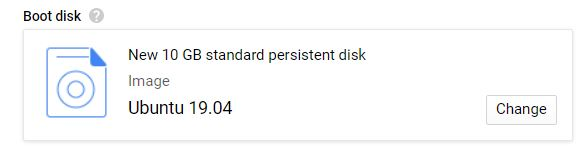

You will also want the firewall to allow http and https traffic.

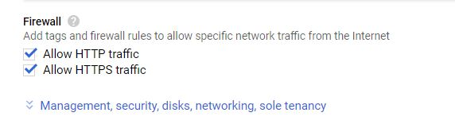

Once you have created your instance, you need to start your instance by going to the compute engine page, selecting your instance, and clicking start at the top. Once you have done this, click on the 3 dots by your instance, and click "open in browser window" to enter your instance.


## 2. Install Apache Tomcat

Here's a detailed tutorial on how to install Apache Tomcat on an Ubuntu machine: https://www.digitalocean.com/community/tutorials/how-to-install-apache-tomcat-8-on-ubuntu-16-04

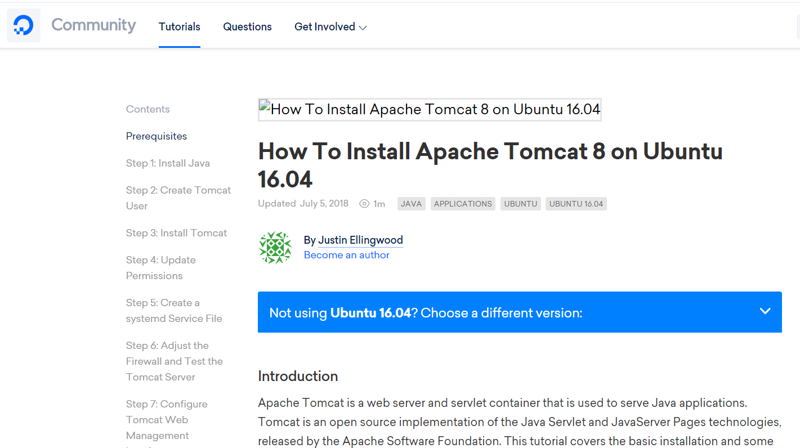

## 3. Install nginx

Here's a tutorial on how to install nginx and use it as a reverse proxy: https://www.keycdn.com/support/nginx-reverse-proxy

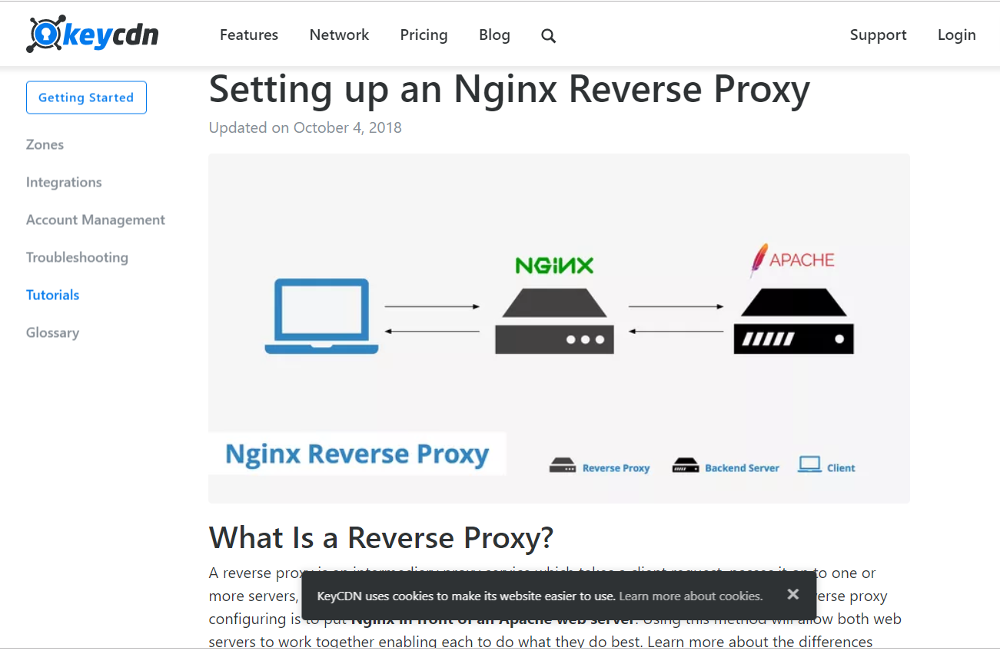

At the end of this step, opening a browser window and navigating to http://{your-external-ip-address} should bring up the java tomcat splash page.

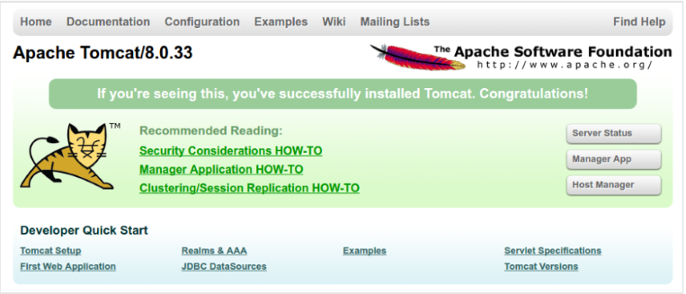

## 4. Edit index.jsp

Now it's time to implement the number generator. Navigate to /opt/tomcat/latest/webapps/ROOT in your VM and edit the index.jsp file. This file is a .jsp file, which means it's in a language for java serverlets. Erase the contents of this file, and add the following line of code to generate a random number each time the webpage is visited.

```<% (int) Math.floor(Math.random() * 1000000)%>```

This line of code will generate a random int between one and a million.

Now, when you visit http://{your-external-ip-address} you should see a random number.

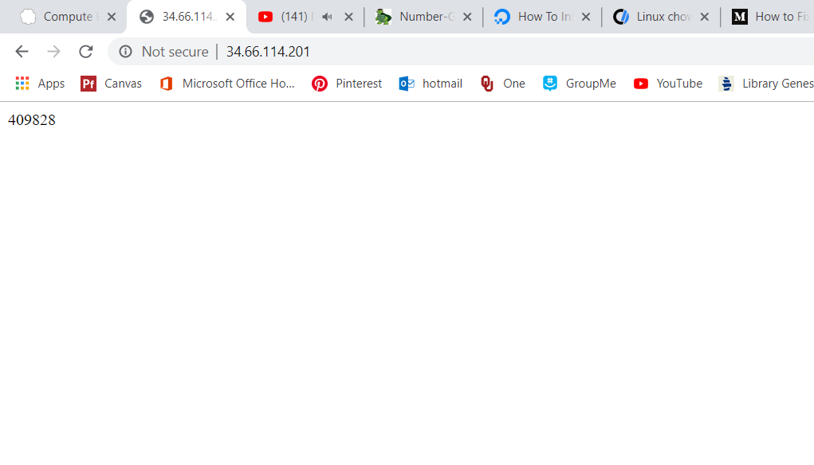

## Java App Engine Documentation
This documentation assumes that you already have access to Google Cloud and money to spend on a virtual machine instance.

### 1. Go to https://console.cloud.google.com/appengine/ 
Log in to your Google account if you haven't already.
Create a new app engine

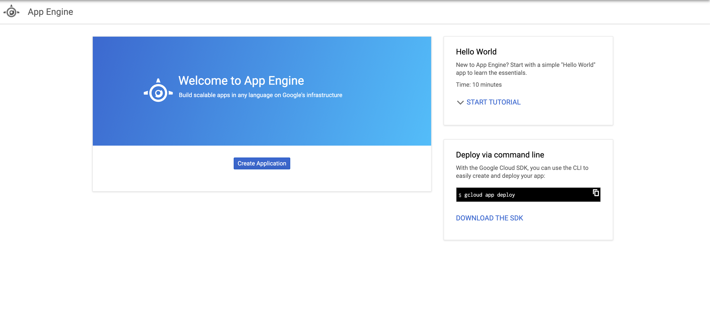

### 2. Activate cloud shell and open java tutorial 


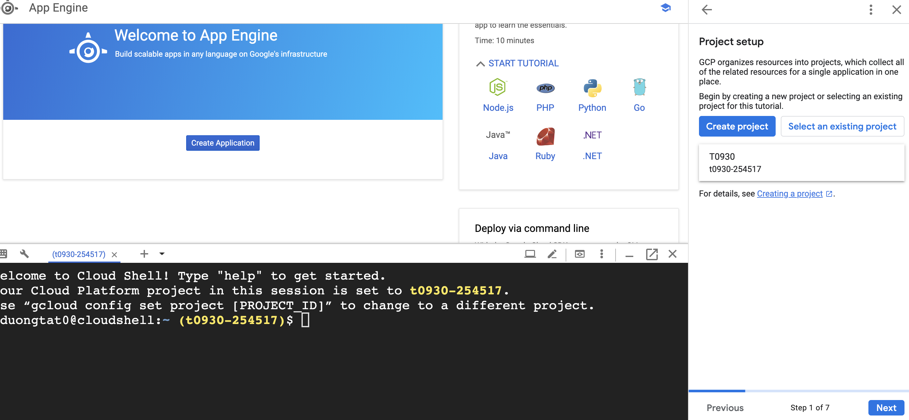

### 3. create new app engine
Run the following commands:

```
rm -rf appengine-try-java
git clone https://github.com/GoogleCloudPlatform/appengine-try-javapython3 -m venv venv
```

This will erase an old app engine and then create a new app engine that ready to use

### 4. make and java file and html file
generate a random number on java file and then make a html file to show it

```
vim src/main/java/myapp/DemoServlet.java
vim src/main/webapp/index.html
```

### 5. Test
deploy app engine and then test the URL


## Python VM Documentation
This documentation assumes that you already have access to Google Cloud and money to spend on a virtual machine instance.

### 1. Go to https://console.cloud.google.com/compute/ 
Log in to your Google account if you haven't already.

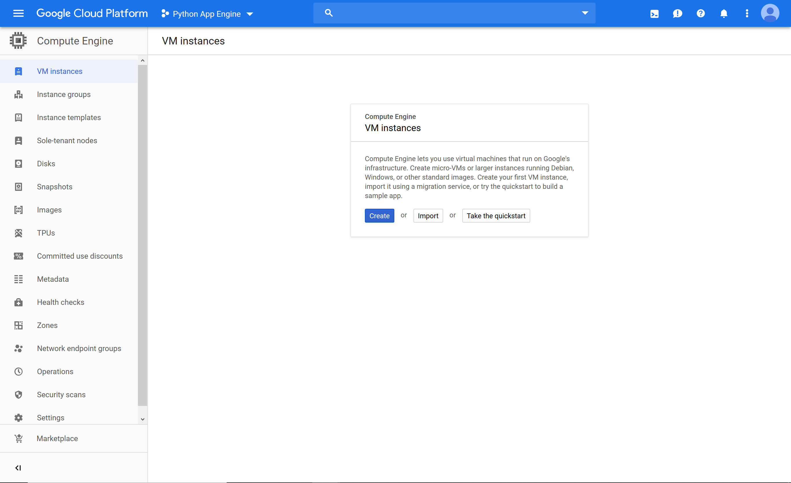

### 2. Create a new Instance 
Press the "Create Instance" button at the top of the page.

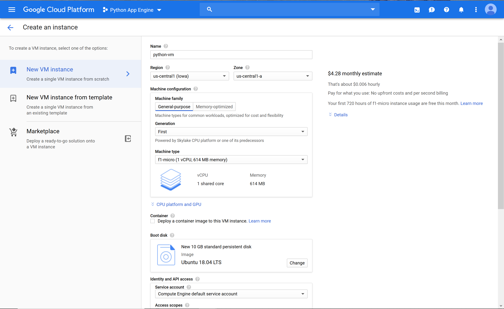

Name your instance something appropriate.

In the "machine type" field, select "f1 micro".

In the "Boot Disk" box, select "change", then select "Ubuntu 18.04 LTS".

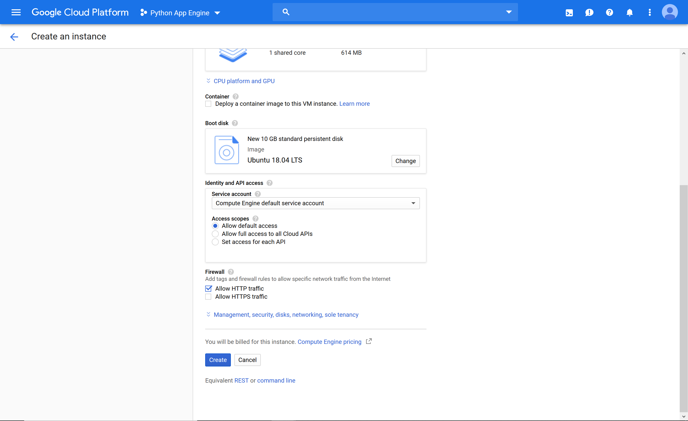

Under "Firewall", check the box next to "Allow HTTP Traffic".

Select "Create" and wait for your VM to start up.

### 3. SSH into your VM


Select "SSH" or choose "Open in Browser Window" from the dropdown. If you are presented by a black screen, try again until you see a "Connecting" message displayed.

### 4. Install necessary software
Run the following commands:

```
sudo apt update
sudo apt-get install python3 python3-pip python3-venv -y
python3 -m venv venv
source venv/bin/activate
pip install Flask
```

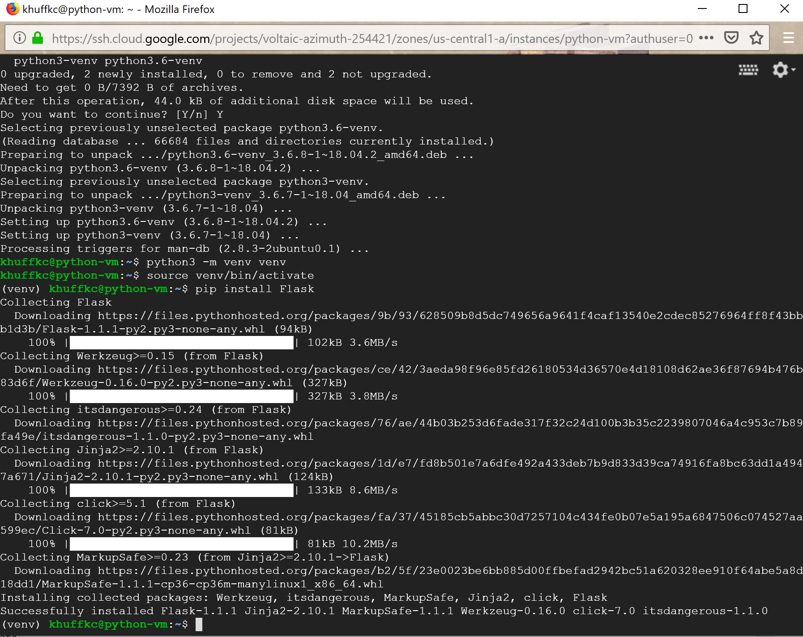

This installs python and all its accoutrements, creates a virtual environment, and installs Flask into that environment.

### 5. Clone this git repository
Run the following command:

```
git clone https://github.com/ocobble/Number-Generator.git
```

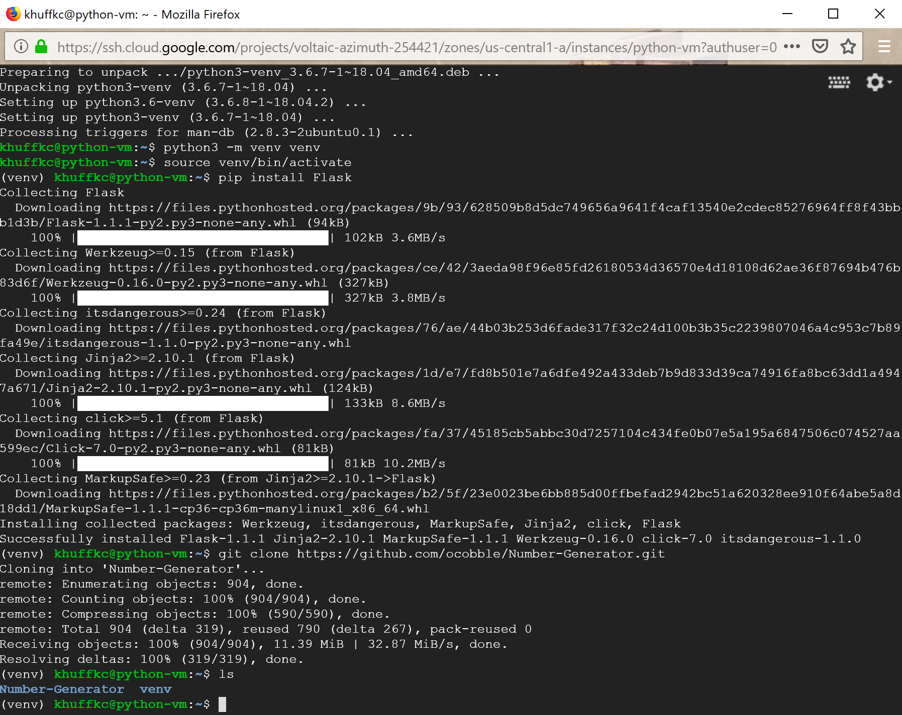

### 6. Add correct firewall settings
Access the main hamburger menu in the upper-right-hand corner of the google cloud console.

Go to VPC Network -> Firewall Rules.

Select "Create Firewall Rule".

Name your new rule.

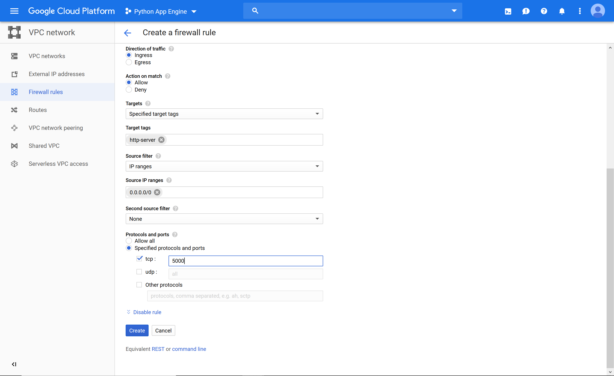

Enter "http-server" in the "Target tags" box.

Enter "0.0.0.0/0" in the "Source IP ranges" box.

Select the "tcp" checkbox under "Protocols and ports".

Enter "5000" in the corresponding box.

Click create.

### 7. Get a Static External IP
Click "External IP addresses" in the sidebar of the "VPC Network" view.

There should be an ip address already in use by your VM.

Change the "Type" dropbox from "Ephemeral" to "Static" and put an appropriate name in the box when it comes up.

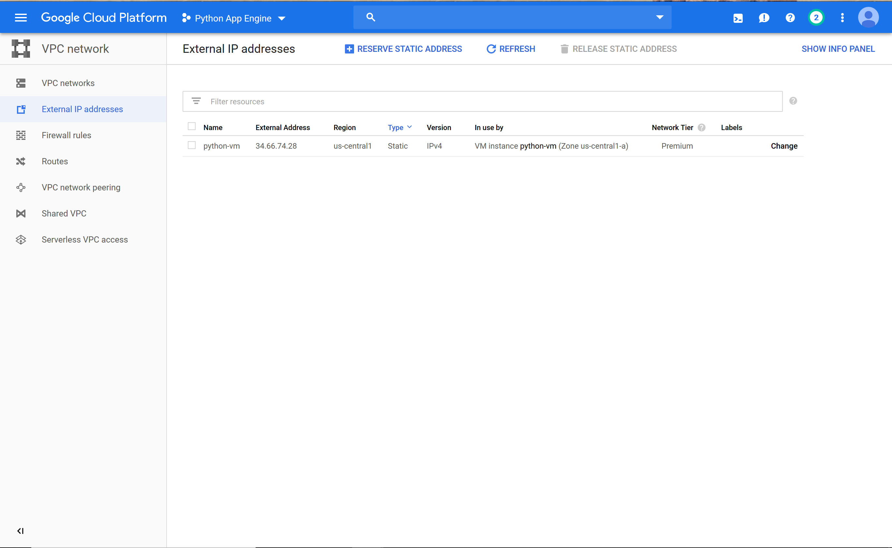

### 6. Start Your Web Server

Open a tmux session in your virtual machine with the command `tmux new`. If you no longer see `(venv)` before your prompt, use the command `source venv/bin/activate` to get it back. This creates a virtual terminal that will keep running after you log out of your instance.

Navigate to `Number-Generator/pythonVM/`.

Run the command `python randomGenerator.py`. This should start the server, and the terminal will not be able to accept any more commands.

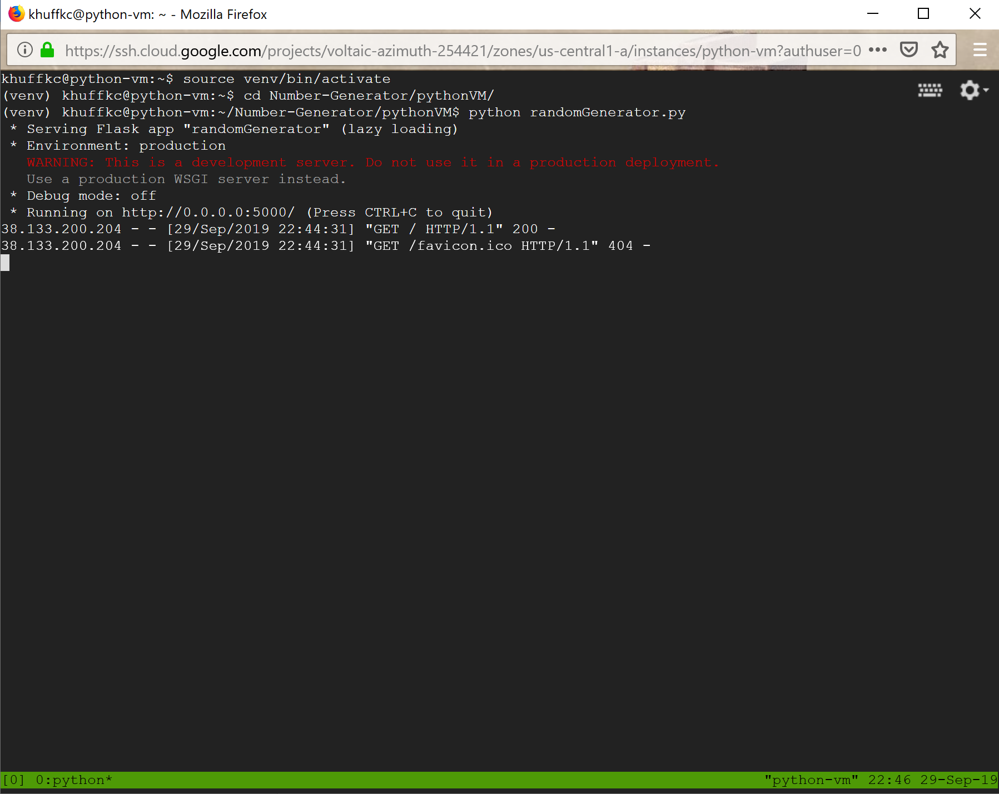

Exit the tmux session while keeping it running in the background by pressing `Ctrl-b`, then `d`. You should be back at a notmal-looking terminal.

Log out of your VM.

### 7. Test
The URL to reach your web server will be `http://YOUR.STATIC.EXTERNAL.IP:5000/`. Test it yourself by typing that into a browser.

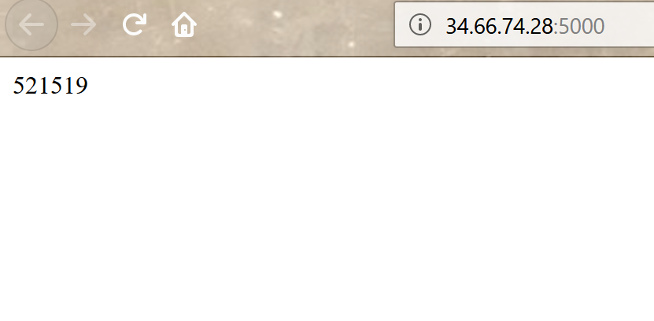


## Python App Engine Documentation
